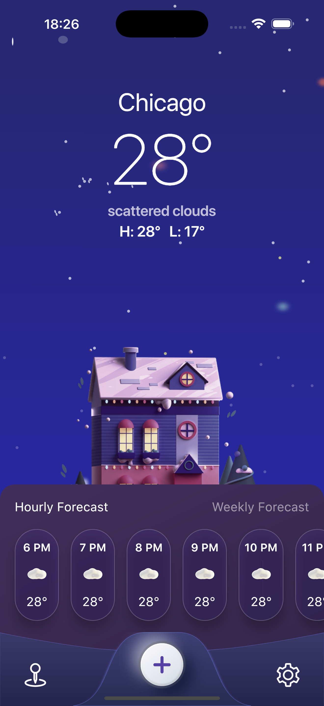
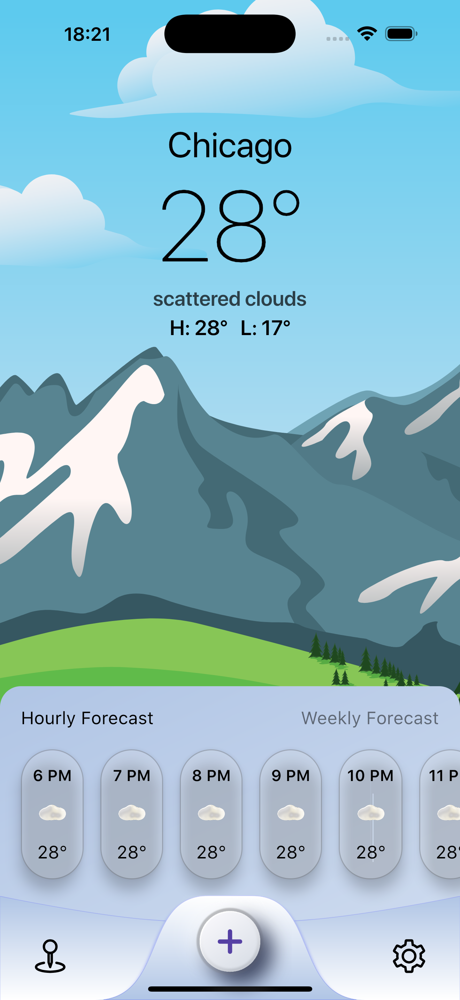
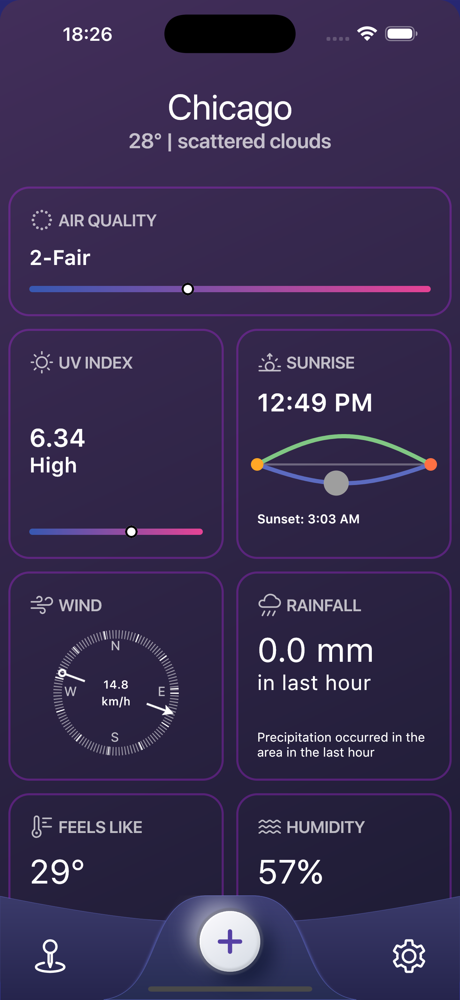
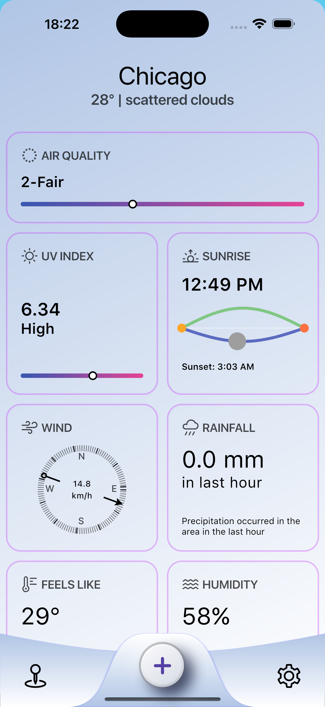
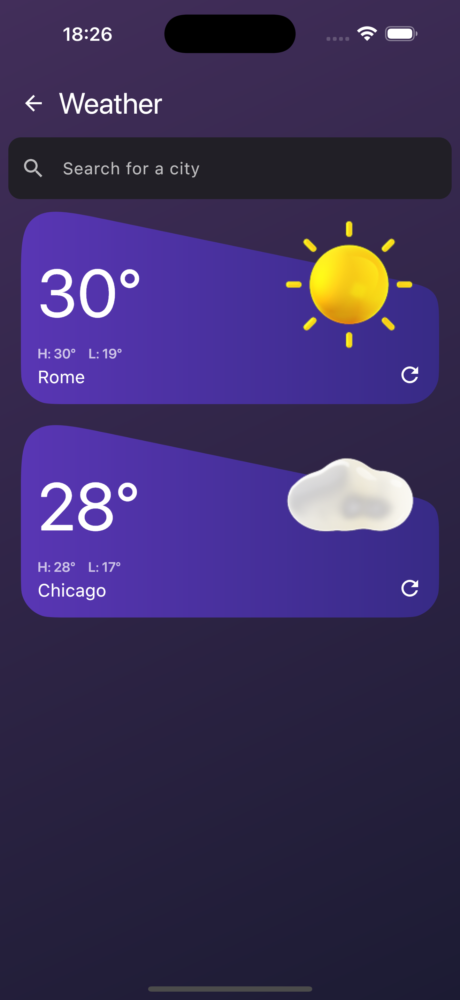
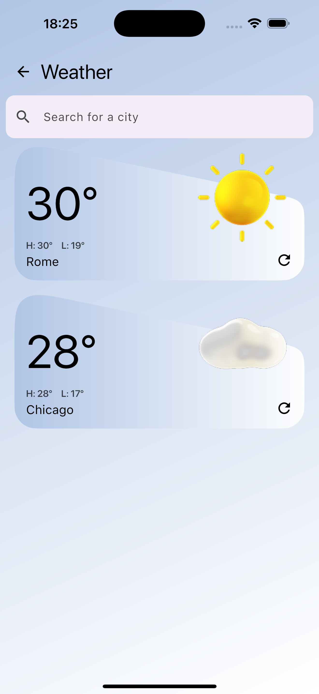
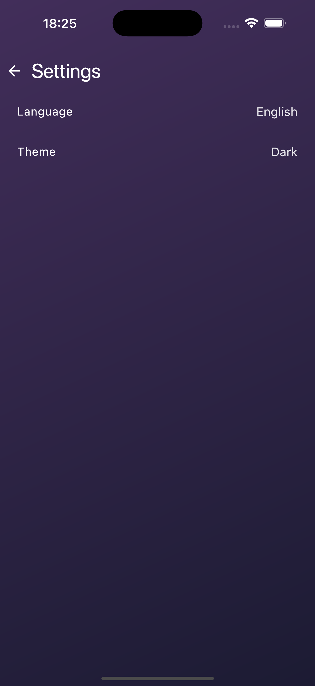
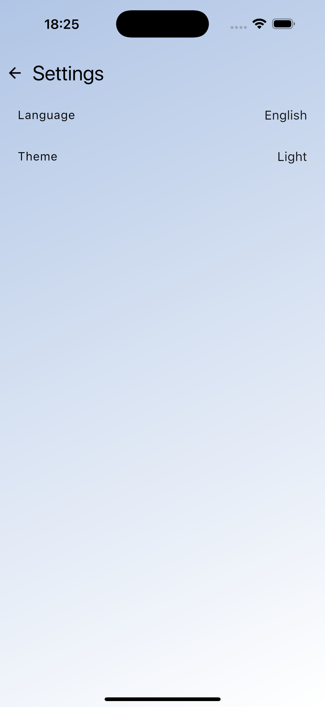

# WeatherApp

WeatherApp is a Kotlin Multiplatform project that provides current weather conditions, along with hourly and weekly forecasts. You can check the weather for your current GPS location or search for specific cities. Save your favorite cities for quick access to their latest weather updates. The app supports English, Italian, and Spanish languages (language selection not available on the Web platform) and offers both light and dark themes.

This project is built with Compose Multiplatform, allowing it to run on Android, iOS, Desktop (Windows, macOS, Linux), and Web (WasmJs).

## Features

*   **Current Weather:** Get up-to-date weather information, including temperature, humidity, pressure, and wind conditions.
*   **Hourly Forecast:** View a detailed weather forecast for the next few hours.
*   **Weekly Forecast:** Plan ahead with a 7-day weather outlook.
*   **Location-Based Weather:** Automatically fetch weather for your current location (requires location permissions).
*   **City Search:** Find weather forecasts for any city worldwide.
*   **Favorite Cities:** Save cities to a list for quick access.
*   **Multi-Language Support:** Available in English, Italian, and Spanish (dynamic language switching supported on Android, iOS, and Desktop).
*   **Theme Selection:** Choose between light and dark themes.
*   **Cross-Platform:** Runs on Android, iOS, Desktop, and Web.

## Screenshots

Here are some glimpses of WeatherApp in action:

_Home screen with weather forecast (Dark Theme)_

_Home screen with weather forecast (Light Theme)_

_Detailed current weather view (Dark Theme)_

_Detailed current weather view (Light Theme)_

_Favorite cities list (Dark Theme)_

_Favorite cities list (Light Theme)_

_Settings screen for theme and language selection (Dark Theme)_

_Settings screen for theme and language selection (Light Theme)_

## Platforms

*   Android
*   iOS
*   Desktop (Windows, macOS, Linux)
*   Web (WasmJs)

## Technologies Used

*   **Kotlin Multiplatform:** For sharing code across platforms.
*   **Compose Multiplatform:** For building declarative UIs from a single codebase.
*   **Ktor:** For networking (fetching weather data).
*   **Kotlinx Serialization:** For JSON parsing.
*   **Kotlinx Coroutines:** For asynchronous programming.
*   **Kotlinx DateTime:** For handling dates and times.
*   **Koin:** For dependency injection.
*   **Voyager:** For navigation in Compose Multiplatform.
*   **Coil:** For image loading (weather icons).
*   **Compass Geolocation & Permissions:** For accessing device location and managing permissions.
*   **DataStore:** For persisting user preferences (e.g., favorite cities, theme) on Android.
*   **Gradle:** For build automation.

## Setup and Build

### Prerequisites

*   JDK 11 or higher.
*   Android Studio (latest stable version recommended).
*   Xcode (for iOS development).
*   An API Key from [OpenWeatherMap](https://openweathermap.org/appid).

### Configuration

1.  **API Key:**
    *   Sign up at [OpenWeatherMap](https://openweathermap.org/appid) to get your free API key.
    *   Create a `local.properties` file in the root directory of the project (`/Users/andreadellaporta/WeatherApp/local.properties`).
    *   Add your API key to this file:
        
\'\'\'properties
        API_KEY=YOUR_OPENWEATHERMAP_API_KEY
\'\'\'
This key will be automatically picked up by the build process.

### Building and Running

*   **Android:**
    Open the project in Android Studio and run the `composeApp` configuration on an Android emulator or device.
*   **iOS:**
    *   Open `iosApp/iosApp.xcworkspace` in Xcode.
    *   Select your target device and run.
*   **Desktop:**
    Run the Gradle task `:composeApp:run` in Android Studio or from the command line:
\'\'\'bash
    ./gradlew :composeApp:run
\'\'\'
    Native distributions (dmg, msi, deb) can be built using tasks like `:composeApp:packageDmg`, `:composeApp:packageMsi`, or `:composeApp:packageDeb`.
*   **Web (WasmJs):**
    Run the Gradle task `:composeApp:wasmJsBrowserDevelopmentRun` in Android Studio or from the command line:
\'\'\'bash
    ./gradlew :composeApp:wasmJsBrowserDevelopmentRun
\'\'\'
    This will start a development server. Open the URL provided in the console (usually `http://localhost:8080`) in your browser.

## Project Structure

*   `/composeApp`: Contains the shared Kotlin Multiplatform code and Compose Multiplatform UI.
    *   `commonMain`: Code common to all targets (Android, iOS, Desktop, Web).
    *   `androidMain`, `iosMain`, `desktopMain`, `wasmJsMain`: Platform-specific implementations and dependencies.
    *   `commonMain/composeResources`: Shared resources like images and fonts.
*   `/iosApp`: The Xcode project for the iOS application.

### Drawable Resource Generation

The project includes a custom Gradle task `generateDrawableMap` (defined in `composeApp/build.gradle.kts`) to automate the handling of SVG drawable resources in `commonMain`.

*   **Input:** SVG files located in `composeApp/src/commonMain/composeResources/drawable/`.
*   **Output:** A Kotlin file named `GeneratedDrawableMap.kt` is generated in the `build/generated/drawablemap/` directory for the `composeApp` module.
*   **Functionality:** This generated file contains:
    *   Type-safe accessors (e.g., `Res.drawable.your_icon`) for each SVG.
    *   String constants (camelCased) for each drawable name (e.g., `val yourIcon = "your_icon"`).
    *   A `drawableMap: Map<String, DrawableResource>` that maps the original SVG file names (e.g., "your\_icon") to their corresponding `DrawableResource` objects. This map can be useful for dynamically accessing drawables by name.
*   **Integration:** The directory containing `GeneratedDrawableMap.kt` is automatically added as a source directory to the `commonMain` source set, making the generated code available across all platforms. Kotlin compilation tasks are configured to depend on `generateDrawableMap`, ensuring the map is generated before compilation.

This setup simplifies the management of shared drawable resources and provides a convenient way to reference them in code.

## Feedback and Contributions

We would appreciate your feedback, especially on Compose for Web (WasmJs).
*   Join the public Slack channel [#compose-web](https://slack-chats.kotlinlang.org/c/compose-web) for discussions.
*   If you encounter any issues, please report them on [YouTrack](https://youtrack.jetbrains.com/newIssue?project=CMP).

Contributions are welcome! Please feel free to submit a pull request or open an issue.

## License

This project is licensed under the MIT License - see the LICENSE.md file for details.
